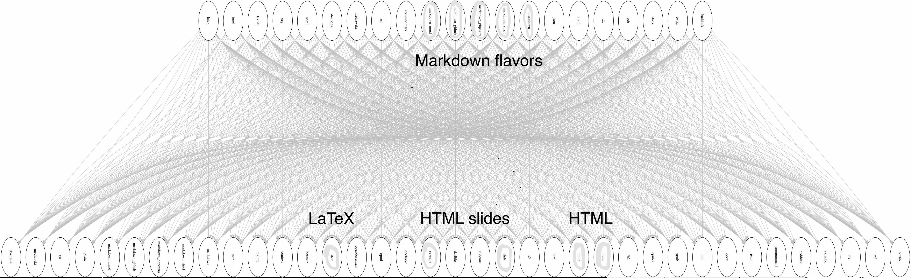

Facilitating Reproducibility and Collaboration with Literate Programming
========================================================
author: Harrison Dekker
date: April 5, 2018
transition: fade

Getting Started
========================================================
This is a *hands on* demo. Slides and supplementary materials are available at <https://github.com/hdekk/escience2018>. We'll be using RStudio, but to save you the trouble of installing it, I'd like you to create accounts on  [RStudio.Cloud](https://rstudio.cloud).

Cloning from GitHub
========================================================
RStudio has built-in support for GitHub. Here's what you need to do to clone the repository for this talk.

1. Choose **New Project** from the **File** menu.
2. From the **Create Project** menu, select **Version Control**.
3. From the next menu, choose **Git**
4. Finally, type the following url into the **Repository URL** box, then click **Create Project**.

Since you're running RStudio in the cloud, you haven't actually copied any files to your local machine. They are in a directory on the server. If you want to run the presentation, find the file named slides.Rpres in the files tab in the lower right panel in RStudio.

Overview
========================================================
type:section
- Motivation for *literate programming*
- RStudio + RMarkdown + Knitr
- RMarkdown exercise
- Academic paper: working example


Motivation
========================================================
type:section

Rethinking Programming
========================================================
> A traditional computer program consists of a text file containing program code. Scattered in amongst the program code are comments which describe the various parts of the code... In **literate programming** the emphasis is reversed. Instead of writing code containing documentation, the literate programmer writes documentation containing code.

<small>Ross Williams. FunnelWeb Tutorial Manual, pg 4. (2000)</small>

In addition, scientific computing invariably involves a variety of inputs (data) and outputs (reports, more data, etc.) which, like code, benefit from organization and description.


Benefits
========================================================
* Minimize **workflow** processes that are tedious, manual.
* Better **organize** our code, data, documentation, and results.
* Facilitate **communication** and collaboration thoughout the research lifecycle
* Conduct **better science** - that is easier to interpret, repeat, and build upon.

RStudio + RMarkdown + Knitr
========================================================
type:section

RStudio
========================================================
 
* **R** - the popular open source software environment for statistical computing and graphics.
* **RStudio** make R easier to use by providing a code editor, debugging and visualization tools, and much more. 

Markdown
========================================================
Easy-to-write plain text markup for formatting documents and reports. For example:
### Emphasis
```
*italic*     **bold**
```
### Headers
```
# Header 1
## Header 2
### Header 3
```
Markdown output 
========================================================
Easy-to-write plain text markup for formatting documents and reports. For example:
### Emphasis
*italic*     **bold**

### Headers
# Header 1
## Header 2
### Header 3

RMarkdown
========================================================
RMarkdown extends Markdown by allowing the evaluation and output of code chunks,
<pre>
## Results
Let's look at summary of our data.

```r
summary(cars$dist)
summary(cars$speed)
```
</pre>
or LaTeX
<pre>
$$
\begin{equation*}
|x|=
\begin{cases} x & \text{if $x\ge 0$,} \\\\
-x &\text{if $x\lt 0$.}
\end{cases}
\end{equation*}
$$
</pre>

Knitr
========================================================
Knitr is an R package that provides an engine for dynamic report generation. It allows R code to be embedded in Markdown, HTML, LaTeX and was developed to facilitate literate programming and reproducible research.



Exercise 1: Interactive knitr document
========================================================
type:prompt


Step 1: Open .Rmd document
========================================================
In the Files panel, open the `Exercise-1` directory, then open `countryPick4.Rmd`. The file contains code that reads in data, then plots it based on provided parameters.

Step 2: Explore .Rmd document
========================================================
Can you spot the Markdown codes and code chunks?  

Let's run some code chunks and see what happens. Clicking the code blocks out of sequence might cause errors. How can you avoid this?

Finally, find the *knit* button and generate an html document from the code.


Challenge - Modify the report
========================================================
> 1. Re-run the report, but modify the code to choose four new countries. 
> 2. (Bonus) If you are familiar with `R` and `ggplot`, try adding a fifth country to this report.

Exercise 2: Academic paper example
========================================================
type:prompt

Create a new project
========================================================
In this exercise we'll retrieve a complete project stored in a GitHub repository and take a close look
at how formatted. We'll begin by creating a new project in RStudio. To do this we'll follow the same steps we used at the beginning of this talk to clone the repository containing the course materials except this time we'll clone this repository:  

### https://github.com/hdekk/midlife

GitHub notes
========================================================
By following these steps, you have cloned a project shared on my public GitHub site onto your workspace on the server or your hard drive if you are running R locally. This approach is fine for a classroom setting or if you are taking a quick look at a project, but a more flexible approach would be to fork the project to your own GitHub repository, then make a local clone of that. This would allow you to push changes you make locally into GitHub thereby giving you a quick and easy way to back up your version control. 

Step 1
========================================================
Using the Files tab in RStudio, locate the file 2-Midlife-Crisis-paper.rmd and open it in the editor.
Once you have the file open, browse the first few lines. Next, run the the first four code chunks by clicking on the green arrows in the upper right corner of  each chunk. Watch what happens in the environment tab. Click on each data object name in the environment tab and view the data.

Step 2
========================================================
Below the fourth code block is a long section of LaTeX. This section is needed to recreate the layout 
used in the original paper because it includes formatting that markdown is unable to do. Note that 
LaTeX markup can be added to our RMarkdown document without having to insert a code block. Knitr
automatically knows how to handle it. It's also possible to embed LaTeX markup within regular text.
Scroll down to line 224 to see an example of this.  Can you see anything different about the markup 
when it's embedded inline?

Step 3
========================================================
Let's knit the document. You may have to turn your popup blocker off to allow the pdf viewer to open.
Compare the final pdf to the RMarkdown code. Is it clear what the code is producing?

Summary
========================================================
- `RMarkdown` enables ideas and questions, the code that implements them, and the results generated by the implementation, to all stay together.
- `RMarkdown` toolchain allows automated, repeatable rendering
  - for publishing to the web and viewing through a browser
  - and (through `LaTeX`) to obtain a submittable manuscript (in PDF or Word).
- All materials used in this talk were developed in RMarkdown.


Acknowledgement
========================================================
Parts of this presentation were adapted from Jenny Bryan's software carpentry lesson which can be found here <https://github.com/datacarpentry/rr-literate-programming>

The original mock academic paper "Money, Happiness, and the Midlife Crisis" was by Professor Richard Ball for Project TIER, an initiative to teach students how to conduct transparent and reproducible quantitative research. <https://www.projecttier.org/>
